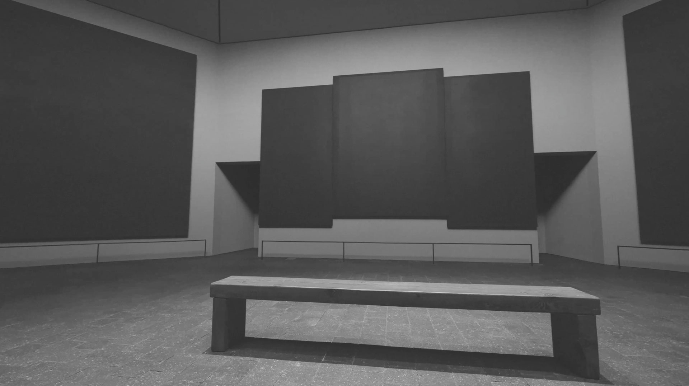

Rothko Day

Rothko Day is a way of viewing the work of Mark Rothko in a digital medium, based off of three paintings in the Rothko Chapel

The allure of a Rothko painting comes from being enveloped in the colors and size of the work. Since most of his paintings are formatted in this vertical way, it is difficult to really feel the work on a screen. The phone fits the aspect ratio, but the screen is too small. When viewed on a computer screen, there is too much white space of the sides. Thus, I have made an alternative way to view his work by laying three of his paintings side by sid, as seen in the Rothko Chapel.

There are 7 paintings for each day of the week, and you can toggle between his lighter and darkers works depending on the time of day or your mood. 